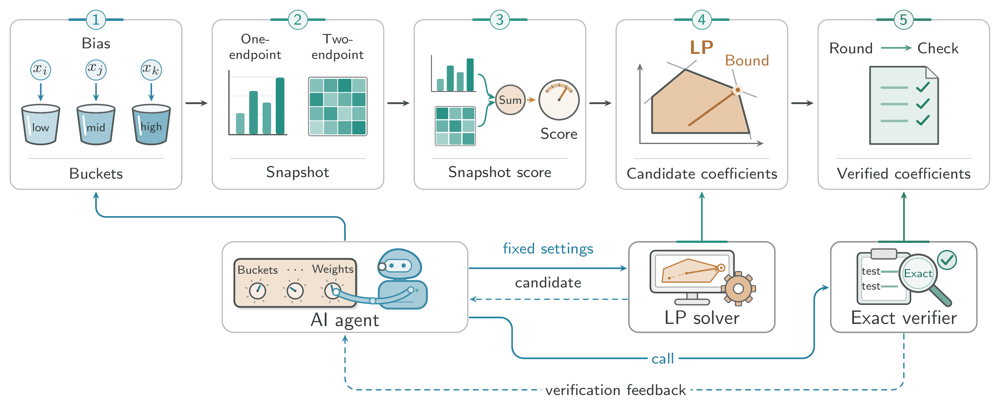

# Max-kSAT: AI-Agent-Assisted Search, Exact Certificates

An AI agent explores the rounding-profile design space; a separate exact verifier checks the resulting rational certificate. This repository releases the **0.742694813 Max-kSAT certificate** and the accompanying manuscript, *Exponential Quantum Space Advantage for Approximating Max-kSAT in the Streaming Setting*, by **Haoyu Wang and Guangxu Yang**.

The manuscript uses this certificate to obtain a **0.7426 approximation to the optimal value** in one pass with polylogarithmic quantum space. The certificate ratio and the streaming ratio differ because the streaming algorithm must absorb snapshot-estimation error. This is a certificate and verification artifact, not an implementation of the quantum streaming algorithm.

## From AI-agent search to a checkable guarantee



*The AI agent, LP solver, and exact verifier from the accompanying manuscript. [Vector version](docs/assets/ai-agent-workflow.svg) · [Original TikZ source](paper/AI_agent.tikz).*

1. **Explore the profile.** The agent adjusts the short-clause cutoff, length weights, bias partition, and rounding probabilities, then uses LP results to guide the next candidate.
2. **Refine the LP.** Violated constraints are added iteratively. Fine-label unary coefficients and shared group-pair coefficients make larger designs tractable.
3. **Freeze the candidate.** The selected coefficients are converted to rational numbers and bound to the numerical input and design by identity checks and SHA-256 manifests.
4. **Replay the mathematics.** A separate verifier recomputes all required constraint families using Python's `fractions.Fraction`. The certificate's correctness is established by these exact checks, rather than by the agent's narrative or a floating-point solver status.

The supplied manuscript describes the agent-assisted search, but this release does not include a complete agent orchestrator, prompts, or the full research environment for rerunning that search. Archived numerical runner files are preserved as provenance; the supported executable workflow is verification of the fixed certificate.

## Current result

| Quantity | Value |
| --- | --- |
| Exact snapshot ratio | `742694813 / 1000000000 = 0.742694813` |
| Paper's streaming approximation | `0.7426` |
| Short-clause cutoff | `5` |
| Bias partition | `500` positive-side buckets; `1000` after reflection |
| Literal labels | `2000` pairs of literal sign and bias bucket |
| Coarse literal-label groups | `20` |
| Exact minimum constraint slack | `1 / 1000000000000` |
| Constraint families | `14` |
| Low-order label pairs | `2,001,000` |
| High-order group multisets | `52,899` |
| Exact upper-envelope transitions | `21,946,945` |

The archived package calls this a **strict development incumbent**. It certifies the stated ratio; it does not establish optimality of the design or a `0.749` guarantee.

## Verify it

Use 64-bit Python 3.10 or newer. Verification requires only the standard library: no LP solver, GPU, or third-party Python package.

**Quick integrity check** (does not recompute the mathematical constraints):

```sh
python3 -B examples.py verify
```

Expected: `PASS`, `Files: 35`, and `Checks: 37`.

**Full exact replay**, with a fresh output directory outside the immutable bundle:

```sh
python3 -B examples.py replay --output-dir replay-output/run-001
```

The exact computation can run silently for several minutes. Success requires `status = exact_verified`, `success = true`, the stated rational ratio and slack, and all coverage and identity flags in `FULL_EXACT_REPLAY.json`. Use a new output directory for each run. Do not use `-O`, `-OO`, or `PYTHONOPTIMIZE`.

The default CI runs the quick integrity check. A manually dispatched workflow can also run the full replay. See [INSTALLING](INSTALLING) for direct commands and Windows instructions, and [the certificate guide](docs/lp_certificate.md) for the proof scope.

## Repository map

- [`artifacts/maxksat/strict-rho-0.742694813/`](artifacts/maxksat/strict-rho-0.742694813/): the supplied 35-file bundle, preserved byte for byte, including exact candidate, numerical payload, provenance, verifier sources, and archived reports.
- [`paper/Main.tex`](paper/Main.tex): entry point for the supplied manuscript; its source files are preserved unchanged.
- [`docs/ai_agent_workflow.md`](docs/ai_agent_workflow.md): agent narrative and a paper-to-code map.
- [`docs/lp_certificate.md`](docs/lp_certificate.md): current mathematical certificate and verification boundaries.
- [`docs/reproduction-guide-zh.md`](docs/reproduction-guide-zh.md): the supplied Chinese cross-machine reproduction guide (historical measurements are identified as such).

The previous code and standalone Max-2SAT companion materials have been replaced by this new Max-kSAT release. The supplied manuscript retains its mathematical discussion of the special case and Boolean CSP classification.

## Provenance and limitations

Keep the immutable bundle unchanged, including its historical Windows paths. Those paths record the original environment; the portable replay tool binds the bundled numerical payload directly by SHA-256. Write reports outside the bundle and use `-B` to avoid adding bytecode files to its closed manifest.

The archived promotion record retains only the hash of a historical mutable experiment-policy snapshot. Its original bytes are unavailable; the bundle documents this explicitly. That policy is outside the immutable mathematical certificate chain. File hashes establish consistency with the supplied manifests, not an external attestation of authorship.

## Citation

Cite Haoyu Wang and Guangxu Yang, *Exponential Quantum Space Advantage for Approximating Max-kSAT in the Streaming Setting*, and identify the exact certificate ratio `742694813/1000000000`. The supplied sources do not specify a venue, DOI, or arXiv identifier.

No software license has been specified in this repository.
